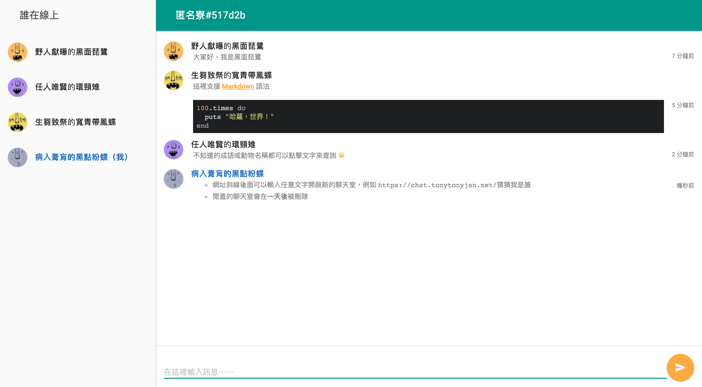

# 匿名寮



前身是五倍紅寶石課程用的匿名聊天室，現在使用 Rails 5 ActionCable 做了改版，對於因為害羞而不好意思舉手發問的學生，可以透過匿名聊天室貼上問題，講師或是助教則會在上面解答。

## 功能介紹

- 支援 [Markdown](http://markdown.tw/) 語法
- 在網址斜線後方輸入任意文字可開啟新的聊天室，例如 `https://chat.tonytonyjan.net/測試`
- 閒置的聊天室會在一天後被刪除
- 暱稱上的成語和動物都可以點擊查詢意思

## 開發

```
bundle
yarn
bin/rails db:setup
bundle exec puma
```
